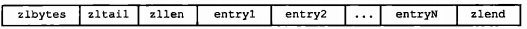

##《Redis设计与实现》[第一部分]数据结构与对象
##**一、简单动态字符串SDS**
> 关键字：空间预分配，惰性空间释放，二进制安全  

C字符串不易更改，所以Redis中把C字符串用在一些无须对字符串值进行修改的地方，作为字符串字面量（String literal），比如打印日志：
redisLog(REDIS_WARING, "Redis is now ready to exit, bye bye...");  

在Redis数据库中，包含字符串的键值对在底层都是由SDS实现的。  

SDS还被用作缓冲区（buffer）：AOF模块中的AOF缓冲区，以及客户端状态中的输入缓冲区，都是SDS实现的。
###数据结构源码
SDS结构的定义在sds.h中：
```C
    /*
     * 保存字符串对象的结构
     */
    struct sdshdr {     
        // buf 中已占用空间的长度
        int len;
        // buf 中剩余可用空间的长度，即未使用空间
        int free;
        // 数据空间
        char buf[];
    };
```
获取一个SDS长度的复杂度为O(1)，由SDS的API在执行时自动设置和更新SDS长度，使用SDS无须进行任何手动修改长度的工作。  
###空间分配策略
SDS的空间分配策略是：当SDS API需要对SDS进行修改时，API会先检查SDS的空间是否满足修改所需的要求，若不满足，API会自动将SDS的空间扩展至执行修改所需的大小，然后才执行实际的修改操作，杜绝了发生缓冲区溢出的可能性。  

通过未使用空间，SDS实现了空间预分配和惰性空间释放两种优化策略：  

- 空间预分配   

空间预分配用于减少连续执行字符串增长操作所需的内存分配次数。  
通过这种预分配策略，SDS将连续增长N次字符串所需的内存重分配次数从必定N次降低为最多N次。
其中额外分配的未使用空间数量由以下公式决定：  

    1. 如果对SDS进行修改后，SDS的长度（即len属性的值）小于1MB，就分配和len属性同样大小的未使用空间，即len属性的值和free属性的值相同   
    2. 如果对SDS进行修改之后，SDS的长度大于等于1MB，就分配1MB的未使用空间。  

- 惰性空间释放  

惰性空间释放用于优化SDS字符串缩短操作的内存重分配操作：当SDS的API需要缩短SDS保存的字符串时，程序并不立即使用内存重分配来回收缩短后多出来的字节，而是使用free属性将这些字节的数量记录起来，并等待将来使用。

SDS的API都是二进制安全的（binary-safe），所有SDS API都会以二进制的方式处理SDS存放在buf数组里的数据，程序不会对其中的数据做任何限制、过滤、或者假设，数据在写入时是什么样的，被读取时就是什么样。  

Redis用SDS的buf数组保存二进制数据而不是字符。  

SDS可以兼容部分C字符串函数。

##**二、链表** 
> 关键字：多态

当一个列表键包含了数量比较多的元素，或是列表中包含的元素都是比较长的字符串时，Redis就会使用链表作为列表键的底层实现。  

integers列表键的底层实现就是一个链表，链表中的每个结点都保存了一个整数值。  

除了链表之外，发布与订阅、慢查询、监视器等功能也用到了链表，Redis服务器本身还使用链表保存多个客户端的状态信息，以及使用链表来构建客户端输出缓冲区（output buffer）。  
###数据结构源码
链表结构的定义在adlist.h中：  

```C
    /*
     - 双端链表节点
     */
    typedef struct listNode {
        // 前置节点
        struct listNode *prev;
        // 后置节点
        struct listNode *next;
        // 节点的值
        void *value;
    } listNode;
    /*
     *双端链表迭代器
     */
    typedef struct listIter {
        // 当前迭代到的节点
        listNode *next;
        // 迭代的方向
        int direction;
    } listIter;
    /*
     - 双端链表结构
     */
    typedef struct list {
        // 表头节点
        listNode *head;
        // 表尾节点
        listNode *tail;
        // 节点值复制函数
        void *(*dup)(void *ptr);
        // 节点值释放函数
        void (*free)(void *ptr);
        // 节点值对比函数
        int (*match)(void *ptr, void *key);
        // 链表所包含的节点数量
        unsigned long len;
    } list;  

```

list结构为链表提供了表头指针head、表尾指针tail，以及链表长度计数器len，dup、free和match成员则是用于实现多态链表所需的类型特定函数：  

- dup函数用于复制链表结点所保存的值  
- free函数用于释放链表结点所保存的值；  
- match函数则用于对比链表结点所保存的值和另一个输入值是否相等。  

Redis的链表实现的特性如下：  

- 双端、无环、带表头指针和表尾指针、带链表长度计数器、多态

##**三、字典**
> 关键字：多态，渐进式rehash，murmurhash2

Redis的数据库就是使用字典来作为底层实现的，对数据库的增、删、改、查也是构建在对字典的操作之上的。  

字典还是哈希键的底层实现之一，当一个哈希键包含的键值对比较多，或是键值对中的元素都是比较长的字符串时，Redis就使用字典作为哈希键的底层实现。  

Redis的字典使用哈希表作为底层实现，一个哈希表里可以有多个哈希表结点，每个哈希表结点就保存了字典中的一个键值对。
###数据结构源码
字典所使用的哈希表在dict.h中定义：
```
    /*
     * 哈希表
     * 每个字典都使用两个哈希表，从而实现渐进式 rehash 。
     */
    typedef struct dictht {    
        // 哈希表数组，数组中的每个元素都是一个指向dictEntry结构的指针
        dictEntry **table;
        // 哈希表大小
        unsigned long size;      
        // 哈希表大小掩码，用于计算索引值
        // 总是等于 size - 1
        unsigned long sizemask;
        // 该哈希表已有节点的数量
        unsigned long used;

    } dictht;
```
- table属性是一个数组，数组中的每个元素都是一个指向dictEntry结构的指针，每个dictEntry结构保存着一个键值对。
- size属性记录了哈希表的大小，即是table数组的大小。
- used属性则记录了哈希表目前已有结点（键值对的数量）
- sizemask属性和哈希值一起决定一个键应该被放到table数组的哪个索引上面  

```
    /*
     * 哈希表节点
     */
    typedef struct dictEntry {      
        // 键
        void *key;
        // 值
        union {
            void *val;
            uint64_t u64;
            int64_t s64;
        } v;
        // 指向下个哈希表节点，形成链表
        struct dictEntry *next;

    } dictEntry;
```
- key属性保存着键值对中的键  
- v属性保存键值对中的值，其中键值对中的值可以是一个指针，或是一个uint64_t整数，或是一个int64_t整数
- next属性指向另一个哈希表结点的指针，使用链地址法解决键冲突问题。  

```
    /*
     * 字典
     */
    typedef struct dict {
        // 类型特定函数
        dictType *type;

        // 私有数据
        void *privdata;

        // 哈希表
        dictht ht[2];

        // rehash 索引
        // 当 rehash 不在进行时，值为 -1
        int rehashidx; /* rehashing not in progress if rehashidx == -1 */

        // 目前正在运行的安全迭代器的数量
        int iterators; /* number of iterators currently running */

    } dict;
```
type属性和privdata属性是针对不同类型的键值对，为创建多态字典而设置的：  

- type属性是一个指向dictType结构的指针，每个dictType结构保存了一簇用于操作特定类型键值对的函数，Redis会为用途不同的字典设置不同的类型特定函数。
- privdata属性保存了需要传给那些类型特定函数的可选参数。

```
/*
 * 字典类型特定函数
 */
typedef struct dictType {

    // 计算哈希值的函数
    unsigned int (*hashFunction)(const void *key);

    // 复制键的函数
    void *(*keyDup)(void *privdata, const void *key);

    // 复制值的函数
    void *(*valDup)(void *privdata, const void *obj);

    // 对比键的函数
    int (*keyCompare)(void *privdata, const void *key1, const void *key2);

    // 销毁键的函数
    void (*keyDestructor)(void *privdata, void *key);
    
    // 销毁值的函数
    void (*valDestructor)(void *privdata, void *obj);

} dictType;
```
- ht属性是一个包含两个项的数组，数组中的每个项都是一个dictht哈希表，一般，字典只使用ht[0]哈希表，ht[1]哈希表只会在对ht[0]哈希表进行rehash时使用。
- rehashidx属性记录了rehash目前的进度，如果目前没有在进行rehash，那么它的值为-1. 

```
    /*
     * 字典迭代器
     *
     - 如果 safe 属性的值为 1 ，那么在迭代进行的过程中，
     - 程序仍然可以执行 dictAdd 、 dictFind 和其他函数，对字典进行修改。
     *
     - 如果 safe 不为 1 ，那么程序只会调用 dictNext 对字典进行迭代，
     - 而不对字典进行修改。
     */
    typedef struct dictIterator {            
        // 被迭代的字典
        dict *d;

        // table ：正在被迭代的哈希表号码，值可以是 0 或 1 。
        // index ：迭代器当前所指向的哈希表索引位置。
        // safe ：标识这个迭代器是否安全
        int table, index, safe;

        // entry ：当前迭代到的节点的指针
        // nextEntry ：当前迭代节点的下一个节点
        //             因为在安全迭代器运作时， entry 所指向的节点可能会被修改，
        //             所以需要一个额外的指针来保存下一节点的位置，
        //             从而防止指针丢失
        dictEntry *entry, *nextEntry;

        long long fingerprint; /* unsafe iterator fingerprint for misuse detection */
    } dictIterator;
```
###哈希方法
Redis计算哈希值和索引值的方法如下：
```
    // 使用字典设置的哈希函数，计算键key的哈希值
    hash = dict->type->hashFunction(key);

    // 使用哈希表的sizemask属性和哈希值，计算出索引值
    // 根据情况不同，ht[x]可以是ht[0]或ht[1]
    index = hash & dict->ht[x].sizemask;
```
```
/* ------------------------- hash functions ------------------------------ */

/* Thomas Wang's 32 bit Mix Function */
unsigned int dictIntHashFunction(unsigned int key)
{
    key += ~(key << 15);
    key ^=  (key >> 10);
    key +=  (key << 3);
    key ^=  (key >> 6);
    key += ~(key << 11);
    key ^=  (key >> 16);
    return key;
}

/* Identity hash function for integer keys */
unsigned int dictIdentityHashFunction(unsigned int key)
{
    return key;
}

static uint32_t dict_hash_function_seed = 5381;

void dictSetHashFunctionSeed(uint32_t seed) {
    dict_hash_function_seed = seed;
}

uint32_t dictGetHashFunctionSeed(void) {
    return dict_hash_function_seed;
}

/* MurmurHash2, by Austin Appleby
 * Note - This code makes a few assumptions about how your machine behaves -
 * 1. We can read a 4-byte value from any address without crashing
 * 2. sizeof(int) == 4
 *
 * And it has a few limitations -
 *
 * 1. It will not work incrementally.
 * 2. It will not produce the same results on little-endian and big-endian
 *    machines.
 */
unsigned int dictGenHashFunction(const void *key, int len) {
    /* 'm' and 'r' are mixing constants generated offline.
     They're not really 'magic', they just happen to work well.  */
    uint32_t seed = dict_hash_function_seed;
    const uint32_t m = 0x5bd1e995;
    const int r = 24;

    /* Initialize the hash to a 'random' value */
    uint32_t h = seed ^ len;

    /* Mix 4 bytes at a time into the hash */
    const unsigned char *data = (const unsigned char *)key;

    while(len >= 4) {
        uint32_t k = *(uint32_t*)data;

        k *= m;
        k ^= k >> r;
        k *= m;

        h *= m;
        h ^= k;

        data += 4;
        len -= 4;
    }

    /* Handle the last few bytes of the input array  */
    switch(len) {
    case 3: h ^= data[2] << 16;
    case 2: h ^= data[1] << 8;
    case 1: h ^= data[0]; h *= m;
    };

    /* Do a few final mixes of the hash to ensure the last few
     * bytes are well-incorporated. */
    h ^= h >> 13;
    h *= m;
    h ^= h >> 15;

    return (unsigned int)h;
}

/* And a case insensitive hash function (based on djb hash) */
unsigned int dictGenCaseHashFunction(const unsigned char *buf, int len) {
    unsigned int hash = (unsigned int)dict_hash_function_seed;

    while (len--)
        hash = ((hash << 5) + hash) + (tolower(*buf++)); /* hash * 33 + c */
    return hash;
}
```
当字典被用作数据库的底层实现，或是哈希键的底层实现时，Redis使用**MurmurHash2**算法计算键的哈希值:  

- 该算法的优点在于，即使输入的键是有规律的，算法仍能给出一个很好的随机分布性，并且算法的计算速度也非常快。  

###rehash方法

为了让哈希表的负载因子（load factor）维持在一个合理的范围之内，当哈希表保存的键值对数量太多或太少时，程序需要对哈希表的大小进行相应的扩展或收缩。  

- 哈希表的负载因子计算公式：load_factor = ht[0].used/ht[0].size

扩展和收缩哈希表的工作可以通过执行rehash（重新散列）操作来完成，Redis对字典的哈希表执行rehash的步骤如下：  

- 为字典的ht[1]哈希表分配空间，这个哈希表的空间大小取决于要执行的操作，以及ht[0]当前包含的键值对数量（即ht[0].used属性的值）  

    1. 如果执行的是扩展操作，那么ht[1]的大小为第一个大于等于ht[0].used*2的2^n（2的n次方幂）；
    2. 如果执行的是收缩操作，那么ht[1]的大小为第一个大于等于ht[0].used的2^n。
    
- 将保存在ht[0]中的所有键值对rehash到ht[1]上面：rehash指的是重新计算键的哈希值和索引值，然后将键值对放置到ht[1]哈希表的指定位置上。
- 当ht[0]包含的所有键值对都迁移到ht[1]之后（ht[0]变为空表），释放ht[0]，将ht[1]设置为ht[0]，并在ht[1]新创建一个空白哈希表，为下一次rehash做准备。

当以下条件中的任意一个被满足时，程序会自动开始对哈希表执行扩展操作： 

- 服务器目前没有在执行BGSAVE命令或BGREWRITEAOF命令，并且哈希表的负载因子大于等于1
- 服务器目前正在执行BGSAVE命令或BGREWRITEAOF命令，并且哈希表的负载因子大于等于5

在执行BGSAVE命令或BGREWRITEAOF命令的过程中，Redis需要创建当前服务器进程的子进程，而大多数操作系统都采用写时复制（copy-on-write）技术来优化子进程的使用效率，所以在子进程存在期间，服务器会提高执行扩展操作所需的负载因子，从而尽可能地避免在子进程存在期间进行哈希表扩展操作，这避免了不必要的内存写入操作，最大限度地节约内存。

当哈希表的负载因子小于0.1时，程序自动开始对哈希表执行收缩操作。

###渐进式rehash

为了避免rehash对服务器性能造成影响，服务器不是一次性将ht[0]里面的所有键值对全部rehash到ht[1]，而是分多次、渐进式地将ht[0]里面的键值对慢慢rehash到ht[1]。 

以下是哈希表渐进式rehash的详细步骤：

1. 为ht[1]分配空间，让字典同时持有ht[0]和ht[1]两个哈希表。

2. 在字典中维持一个索引计数器变量rehashidx，值设置为0，表示rehash工作正式开始

3. 在rehash进行期间，每次对字典执行添加、删除、查找或者更新操作时，程序除了执行指定的操作以为，还会顺带将ht[0]哈希表在rehashidx索引上的所有键值对rehash到ht[1]，当rehash工作完成之后，程序将rehashidx属性的值增一。

4. 随着字典操作的不断执行，最终在某个时间点上，ht[0]的所有键值对都会被rehash到ht[1]上，这是程序将rehashidx属性的值设为-1，表示rehash操作已完成

渐进式rehash采取分而治之的方式，将rehash键值对所需的计算工作均摊到对字典的每个添加、删除、查找和更新操作上，从而避免了集中式rehash而带来的庞大计算量。

在进行渐进式rehash的过程中，字典会同时使用ht[0]和ht[1]两个哈希表，所以在渐进式rehash进行期间，字典的删除、查找、更新会在两个哈希表上进行，比如现在ht[0]中查找，没找到再去ht[1]查找

在渐进式rehash执行期间，新添加到字典的键值对一律会被保存到ht[1]里面，而ht[0]则不再进行任何添加操作，这样保证了ht[0]包含的键值对数量只减不增，随着rehash操作的执行最终变成空表。

##**四、跳跃表**
> 关键字：层高随机

跳跃表支持平均O（logN）、最坏O(N)复杂度的结点查找，还可以通过顺序性操作来批量处理结点。

在大部分情况下，跳跃表的效率可以和平衡树相媲美，因为跳跃表的实现比平衡树来得更为简单，所以不少程序都使用跳跃表代替平衡树。

Redis使用跳跃表作为有序集合键的底层实现之一，如果有一个有序集合包含的元素数量比较多，或有序集合中元素的成员是比较长的字符串时，Redis就会使用跳跃表作为有序集合键的底层实现。

Redis只在两个地方用到了跳跃表，一个是实现有序集合键，另一个是在集群结点中用作内部数据结构
###数据结构源码
Redis的跳跃表由redis.h/zskiplistNode和redis.h/zskiplist两个结构定义：
```
/*
 * 跳跃表节点
 */
typedef struct zskiplistNode {

    // 成员对象
    robj *obj;

    // 分值
    double score;

    // 后退指针
    struct zskiplistNode *backward;

    // 层
    struct zskiplistLevel {

        // 前进指针
        struct zskiplistNode *forward;

        // 跨度
        unsigned int span;

    } level[];

} zskiplistNode;
```
zskiplistNode结构包含以下属性：  

- 层（level）数组可以包含多个元素：每个层带有两个属性：前进指针和跨度。前进指针用于访问位于表尾方向的其他结点，而跨度则记录了前进指针所指向结点和当前节点的距离。当程序从表头向表尾进行遍历时，访问会沿着层的前进指针进行。层的数量越多，访问其他结点的速度就越快。
    + 每次创建一个新跳跃表结点，程序都根据幂次定律（power law，越大的数出现的概率越小）随机生成一个介于1和32之间的值作为level数组的大小，即层的高度。
    + 前进指针为NULL的层跨度为0

- 后退（backward）指针：结点中用BW字样标记结点的后退指针，它指向位于当前节点的前一个结点。后退指针在程序从表尾向表头遍历时使用。与可以一次跳过多个结点的前进指针不同，每个结点只有一个后退指针，所以每次只能后退至前一个结点

- 分值（score）：一个double类型的浮点数，跳跃表中，结点按各自所保存的分值从小到大排列
- 成员对象（obj）：一个指针，指向保存着一个SDS值的字符串对象
- 在同一个跳跃表中，各个节点保存的成员对象必须是唯一的，但是多个结点保存的分值可以相同：分值相同的结点按照成员对象在字典序中的大小排序，较小的排在前面（靠近表头）

```
/*
 * 跳跃表
 */
typedef struct zskiplist {

    // 表头节点和表尾节点
    struct zskiplistNode *header, *tail;

    // 表中节点的数量
    unsigned long length;

    // 表中层数最大的节点的层数
    int level;

} zskiplist;
```
zskiplist结构用于保存跳跃表结点的相关信息，如结点数量，指向表头结点和表尾结点的指针等：

- header:指向跳跃表的表头结点
- tail：指向跳跃表的表尾结点
- level：记录目前跳跃表内，层数最大的那个结点的层数（表头结点的层数不计算在内）
- length:记录跳跃表的长度，即，跳跃表目前包含结点的数量（表头结点不计算在内）

表头结点和其他结点的构造是一样的：表头结点也有后退指针、分值和成员对象，不过表头结点的这些属性都不会被用到。

##**五、整数集合**
> 关键字：升级规则

整数集合（intset）是集合键的底层实现之一，当一个集合只包含整数值元素，并且这个集合的元素数量不多时，Redis就使用整数集合作为集合键的底层实现。
###数据结构源码
```
typedef struct intset {
    
    // 编码方式
    uint32_t encoding;

    // 集合包含的元素数量
    uint32_t length;

    // 保存元素的数组
    int8_t contents[];

} intset;
```
整数集合（intset）是Redis用于保存整数值的集合抽象数据结构，可以保存类型为int16_t、int32_t或int64_t的整数值，并且保证集合中不会出现重复元素。

- contents数组是 整数集合的底层实现：整数集合的每个元素都是contents数组的一个数组项，各个项在数组中按值的大小从小到大有序排列，并且数组中不包含任何重复项

- length属性记录了整数集合包含的元素数量，即contents数组的长度

- encoding属性：虽然intset结构将contents属性声明为int8_t类型的数组，但实际上contents数组并不保存任何int8_t类型的值，contents数组的真正类型取决于encoding属性的值
    + 若encoding属性的值为INTSET_ENC_INT16,那么contents就是一个int16_t类型的数组，数组里的每个项都是一个int16_t类型的整数值（最小为-32768，最大为32767）
    + 如果encoding属性的值为INTSET_ENC_INT32，那么contents是一个int32_t类型的数组，每个项都是一个int32_t类型的整数值（最小-2147483648，最大2147483647）
    + 如果encoding属性的值为INTSET_ENC_INT64，那么contents是一个int64_t类型的数组，数组每个项是一个int64_t类型的整数值（最小为-9223372036854775808，最大为9223372036854775807）

###整数集合的升级策略
当将一个新元素添加到整数集合里面，并且新元素的类型比整数集合现有所有元素的类型都要长时，整数集合需要先进行升级（upgrade），然后才能将新元素添加到整数集合里面。

升级整数集合并添加新元素共分为三步进行：

1. 根据新元素的类型，扩展整数集合底层数组的空间大小，并为新元素分配空间
2. 将底层数组现有的所有元素都转换成与新元素相同的类型，并将类型转换后的元素放置到正确的位置上，而且在放置元素的过程中，需要继续维持底层数组的有序性质不变
3. 讲新元素添加到底层数组里面

因为每次向整数集合添加新元素都可能会引起升级，而每次升级都需要对底层数组中已有的所有元素进行类型转换，所以向整数集合添加新元素的时间复杂度为O(N)

引发升级的新元素长度总是比整数集合现有所有元素的长度都大，所以这个新元素的值要么大于所有现有元素，要么小于所有现有元素：

- 新元素小于所有现有元素，新元素会被放置在底层数组的最开头（索引0）
- 新元素大于所有现有元素，新元素放置在底层数组的最末尾（索引length-1）

整数集合的升级策略有两个好处：

- 提升整数集合的灵活性，可以随意将int16_t、int32_t或int64_t类型的整数添加到集合中，不必担心出现类型错误

- 节约内存，这样做可以让集合能同时保存三种不同类型的值，又可以确保升级操作只会在有需要的时候进行

**整数集合不支持降级操作**，一旦对数组升级，编码就会一直保持升级后的状态。

##**六、压缩列表**
> 关键字：连锁更新

压缩列表（ziplist）是列表键和哈希键的底层实现之一。当一个列表键只包含少量列表项，且每个列表项要么是小整数值，要么是长度比较短的字符串，那么Redis就会是一压缩列表来做列表键的底层实现

压缩列表是Redis为了节约内存开发的，是由一系列特殊编码的连续内存块组成的顺序型（sequential）数据结构。一个压缩列表可以包含任意多个结点（Entry），每个结点保存一个字节数组或一个整数值。
###数据结构源码


```
/* 
空白 ziplist 示例图

area        |<---- ziplist header ---->|<-- end -->|

size          4 bytes   4 bytes 2 bytes  1 byte
            +---------+--------+-------+-----------+
component   | zlbytes | zltail | zllen | zlend     |
            |         |        |       |           |
value       |  1011   |  1010  |   0   | 1111 1111 |
            +---------+--------+-------+-----------+
                                       ^
                                       |
                               ZIPLIST_ENTRY_HEAD
                                       &
address                        ZIPLIST_ENTRY_TAIL
                                       &
                               ZIPLIST_ENTRY_END

非空 ziplist 示例图

area        |<---- ziplist header ---->|<----------- entries ------------->|<-end->|

size          4 bytes  4 bytes  2 bytes    ?        ?        ?        ?     1 byte
            +---------+--------+-------+--------+--------+--------+--------+-------+
component   | zlbytes | zltail | zllen | entry1 | entry2 |  ...   | entryN | zlend |
            +---------+--------+-------+--------+--------+--------+--------+-------+
                                       ^                          ^        ^
address                                |                          |        |
                                ZIPLIST_ENTRY_HEAD                |   ZIPLIST_ENTRY_END
                                                                  |
                                                        ZIPLIST_ENTRY_TAIL
*/
```
- zlbytes属性:uint32_t类型，4个字节，记录整个压缩列表占用的内存字节数：在对压缩列表进行内存重分配，或计算zlend的位置时使用
- zltail属性：uint32_t类型，4个字节，记录压缩列表表尾结点距离压缩列表的起始地址有多少字节：通过这个偏移量，无须遍历整个压缩列表就可以确定表尾结点的地址
- zllen属性：uint16_t类型，2个字节，记录了压缩列表包含的结点数量：当这个值小于uint16_max（65535）时，这个值是压缩列表包含结点的数量；当这个值等于uint16_max时，结点的真实数量需要遍历整个压缩列表才能计算出
- extryX属性：列表结点，字节数不定，压缩列表包含的各个节点，结点的长度由节点保存的内容决定
- zlend属性：uint8_t类型，1个字节，特殊值0xFF（十进制255），用于标记压缩列表的末端

```
/*
 * 保存 ziplist 节点信息的结构
 */
typedef struct zlentry {

    // prevrawlen ：前置节点的长度
    // prevrawlensize ：编码 prevrawlen 所需的字节大小
    unsigned int prevrawlensize, prevrawlen;

    // len ：当前节点值的长度
    // lensize ：编码 len 所需的字节大小
    unsigned int lensize, len;

    // 当前节点 header 的大小
    // 等于 prevrawlensize + lensize
    unsigned int headersize;

    // 当前节点值所使用的编码类型
    unsigned char encoding;

    // 指向当前节点的指针
    unsigned char *p;

} zlentry;
```
每个压缩列表结点可以保存一个字节数组或者一个整数值，其中，字节数组可以是以下三种长度的其中一种：

- 长度小于等于63（2^6-1）字节的字节数组
- 长度小于等于16383（2^14-1）字节的字节数组
- 长度小于等于4294967295（2^32-1）字节的字节数组

整数值则可以是以下中的一种：

- 4位长，介于0到12之间的无符号整数
- 1字节长的有符号整数
- 3字节长的有符号整数
- int16_t类型整数
- int32_t类型整数
- int64_t类型整数

每个压缩列表结点都由previous_entry_length、encoding、content三个部分：

- 结点的previous_entry_length属性以字节为单位，记录了压缩列表中前一个结点的长度。previous_entry_length属性的长度可以是1字节或5字节
    + 若前一结点的长度小于254字节，那么previous_entry_length的长度为1字节：前一结点的长度就保存在这一个字节里面
    
    + 如果前一结点长度大于等于254字节，那么previous_entry_length属性的长度为5字节：其中属性的第一字节会被设置为0xFE（十进制254），而之后的四个字节则用于保存前一结点的长度
    
    + 因为结点的previous_entry_length属性记录了前一个结点的长度，所以程序可以通过指针运算，根据当前节点的起始地址计算出前一个结点的起始地址
    
    + 压缩列表的从表尾向表头遍历操作就是使用这一原理实现的，只要拥有一个指向某个结点起始地址的指针，那么通过这个指针以及这个结点的previous_entry_length属性，就可以一直向前一个结点回溯，最终到达压缩列表的表头结点。
    
- encoding属性记录了结点的content属性所保存数据的类型以及长度：
    + 一字节、两字节或五字节长，值的最高位为00、01或者10的是字节数组编码：这种编码表示节点的content属性保存着字节数组，数组的长度由编码除去最高两位之后的其他位记录
    + 一字节长，值的最高位以11开头的是整数编码：这种编码表示节点的content属性保存着整数值，整数值的类型和长度由编码最高两位之后的其他位记录
    
- content属性保存结点的值，结点值可以是一个字节数组或整数，值的类型和长度由节点的encoding属性决定

###连锁更新
压缩列表的添加新节点操作和删除结点操作都可能会引发连锁更新：

连锁更新在最坏情况下需要对压缩列表执行N次空间重分配操作，而每次空间重分配的最坏复杂度为O（N），所以连锁更新的最坏复杂度为O(N^2)

尽管连锁更新的复杂度较高，但它真正造成性能问题的可能性不大：

- 压缩列表要恰好有多个连续、长度介于250字节到253字节之间的结点，连锁更新才可能被引发
- 其次，即使出现连锁更新，但只要被更新的结点数量不多，就不会对性能造成影响

##**七、对象**
> 关键字：编码转换，多态命令，内存回收与共享，LRU

Redis基于以上数据结构创建了一个对象系统，这个系统包含字符串对象、列表对象、哈希对象、集合对象和有序集合对象这五种类型的对象，每种对象都用到了至少一种以上数据结构。

使用对象的好处：

- Redis执行命令前，根据对象的类型判断一个对象是否可以执行给定命令
- 可以针对不同的使用场景，为对象设置多种不同的数据结构实现，从而优化对象在不同场景下的使用效率
- Redis的对象系统实现了基于引用计数技术的内存回收机制，当程序不再使用某个对象的时候，这个对象所占用的内存就会被自动释放
- Redis还通过引用计数技术实现了对象共享机制，通过让多个数据库键共享同一个对象来节约内存
- Redis的对象带有访问时间记录信息，该信息可以用于计算数据库键的空转时长，在服务器启用maxmemory功能的情况下，空转时长大的那些键可能会被优先删除

###数据结构源码
Redis使用对象来表示数据库中的键和值，数据库中新创建一个键值对时，至少会创建两个对象：键对象，用作键值对的键，值对象，用作键值对的值
```
typedef struct redisObject {

    // 类型
    unsigned type:4;

    // 编码
    unsigned encoding:4;

    // 对象最后一次被访问的时间，用于计算对象的空转时长
    // 当服务器占用的内存数超过了maxmemory选项设置的上限时，空转时长高的那部分键会优先被服务器释放，从而回收内存
    unsigned lru:REDIS_LRU_BITS; /* lru time (relative to server.lruclock) */

    // 引用计数
    int refcount;

    // 指向实际值的指针
    void *ptr;

} robj;
```
Redis中的每个对象都由一个redisObject结构表示，该结构中的type属性、encoding属性和ptr属性与保存数据有关：

- type属性记录对象的类型，是常量，可选值有REDIS_STRING字符串对象，REDIS_LIST列表对象，REDIS_HASH哈希对象，REDIS_SET集合对象，REDIS_ZSET有序集合对象
- 对于Redis数据库保存的键值对来说，键总是一个字符串对象，而值则可以是字符串对象、列表对象、哈希对象、集合对象或者有序集合对象的一种

- type命令的实现方式也类似，对一个数据库键执行type命令时，命令返回的结果为数据库键对应的值对象的类型。

- encoding属性记录了对象所使用的编码，即对象使用了什么数据结构作为对象的底层实现

通过encoding设定对象所使用的编码，使得Redis可以根据不同的使用场景为一个对象设置不同的编码，从而优化对象在某一场景下的效率

###字符串对象的编码转换
字符串对象的编码可以是int、raw或embstr。

如果一个字符串对象保存的是long类型的整数值，那么字符串对象会将整数值保存在字符串对象结构的ptr属性里（将void*转换成long），并将字符串对象的编码设置为int。

如果字符串对象保存的是一个字符串值，并且这个字符串值的长度小于等于32字节，那么字符串对象将使用embstr编码的方式来保存这个字符串值。

可以用long double类型表示的浮点数在Redis中也是作为字符串值保存的。

对于int编码的字符串对象，如果我们向对象执行了一些命令，使对象保存的不再是整数，而是一个字符串值，那么字符串对象的编码将从int变为raw。

embstr编码的字符串对象实际上是只读的。对embstr编码的字符串对象执行任何修改命令时，程序会先将对象的编码从embstr转换成raw，然后再执行修改命令。所以，embstr编码的字符串对象在执行修改命令后，总会变成一个raw编码的字符串对象

###列表对象的编码转换
列表对象的编码可以是ziplist或Linkedlist。

ziplist编码的列表对象使用压缩列表作为底层实现，每个压缩列表结点（Entry）保存了一个列表元素。

Linkedlist编码的列表对象使用双端链表作为底层实现，每个双端链表结点（Node）保存一个字符串对象，而每个字符串对象保存一个列表元素。

当列表对象同时满足以下两个条件时，列表对象使用ziplist编码：

- 列表对象保存的所有字符串元素的长度都小于64字节
- 列表对象保存的元素数量小于512个

否则使用linkedlist编码。

###哈希对象的编码转换
哈希对象的编码可以是ziplist或hashtable。

ziplist编码的哈希对象使用压缩列表作为底层实现，每当有新的键值对要加入到哈希对象时，程序会先将保存键的压缩列表结点推入到压缩列表表尾，然后再将保存值的压缩列表结点推入到压缩列表表尾：

- 保存了统一键值对的两个结点总是紧挨在一起，保存键的结点在前，保存值的结点在后
- 先添加到哈希对象中的键值对会被放在压缩列表的表头方向，而后来添加到哈希对象的键值对在压缩列表的表尾方向

hashtable编码的哈希对象使用字典作为底层实现，哈希对象中的每个键值对都使用一个字典键值对来保存：

- 字典的每个键都是一个字符串对象，对象中保存了键值对的键
- 字典的每个值都是一个字符串对象，对象中保存了键值对的值

当哈希对象同时满足下列两个条件时，哈希对象使用ziplist编码：

- 哈希对象保存的所有键值对的键和值的字符串长度都小于64字节
- 哈希对象保存的键值对数量小于512个

否则需要使用hashtable编码。

###集合对象的编码转换
集合对象的编码可以是intset或hashtable。

intset编码的集合对象使用整数集合作为底层实现，集合对象包含的所有元素都被保存在整数集合里。

hashtable编码的集合对象使用字典作为底层实现，字典的每个键都是一个字符串对象，每个字符串对象包含一个集合元素，而字典的值则全部被设置为null.

当满足以下两个条件时，使用intset编码：

- 集合对象保存的所有元素都是整数值
- 集合对象保存的元素数量不超过512个

否则使用hashtable编码。

###有序集合对象的编码转换
有序集合的编码可以是ziplist或skiplist。

ziplist编码的有序集合对象使用压缩列表作为底层实现，每个集合元素使用两个紧挨在一起的压缩列表结点保存，第一个结点保存元素的成员（member），第二个元素则保存元素的分值（score）。

压缩列表内的集合元素按分值从小到大进行排序，分值较小的元素靠近表头的方向，分值较大靠近表尾。

skiplist编码的有序集合对象使用zset结构作为底层实现，一个zset结构同时包含一个字典和一个跳跃表：
```
/*
 * 有序集合
 */
typedef struct zset {

    // 字典，键为成员，值为分值
    // 用于支持 O(1) 复杂度的按成员取分值操作
    dict *dict;

    // 跳跃表，按分值排序成员
    // 用于支持平均复杂度为 O(log N) 的按分值定位成员操作
    // 以及范围操作
    zskiplist *zsl;

} zset;
```
有序集合每个元素的成员都是一个字符串对象，而每个元素的分值都是一个double类型的浮点数。

虽然zset结构同时使用跳跃表和字典来保存有序集合元素，但这两种数据结构都会通过指针来共享相同元素的成员和分值，所以同时使用跳跃表和字典保存集合元素，不会产生重复成员和分值，不会因此浪费额外内存。

满足以下两个条件时，对象使用ziplist编码：

- 有序集合保存的元素数量小于128个
- 有序集合保存的所有元素成员的长度都小于64字节

否则有序集合对象使用skiplist编码。

###类型检查与命令多态
Redis中用于操作键的命令可分为两种类型：

- 一种可以对任何类型的键执行，比如del命令、expire命令、rename命令、type命令、Object命令
- 一种智能对特定类型的键执行的命令

在执行一个类型特定的命令之前，Redis会先检查输入键的类型是否正确，然后再决定是否执行给定的命令。

类型特定命令的类型检查是通过redisObject结构的type属性来实现的：

- 在执行一个类型特定命令之前，服务器会先检查输入数据库键的值对象是否为执行命令所需的类型，若是，执行命令；
- 否则服务器拒绝执行命令，并向客户端返回一个类型错误。

Redis还会根据对象的编码方式，选择正确的命令实现代码来执行命令。

###内存回收与对象共享
Redis通过引用计数技术实现内存回收机制。

对象的引用计数信息会随着对象的使用状态而不断变化：

- 在创建一个新对象时，引用计数的值会被初始化为1
- 当对象被一个新程序使用时，它的引用计数加一
- 当对象不再被一个程序使用时，它的引用计数减一
- 当对象的引用计数值变为0时，对象所占用的内存会被释放

基于引用计数的对象共享机制使Redis更节约内存。

Redis的共享对象包括字符串键，以及那些在数据结构中嵌套了字符串对象的对象（linkedlist编码的列表对象、hashtable编码的哈希对象、hashtable编码的集合对象，zset编码的有序集合对象）也可以使用这些共享对象。

Redis只对包含整数值的字符串对象进行共享。
