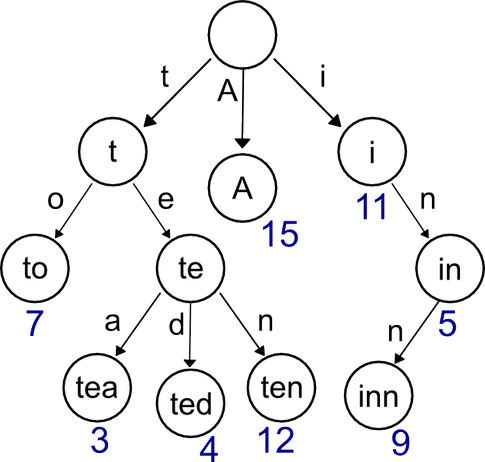

使用Trie树解决数字位操作问题。
##**Trie树**
Trie树可以将keys/numbers/strings等信息保存在树中。  
Trie树由一系列结点组成，每个结点存储一个字符/位。从而我们可以插入新的strings/numbers。  
以trie树存储strings为例：    
  

但现在我们要用trie树解决数字问题，特别是二进制位。问题如下：  

>**Problem1**: Given an array of integers, we have to find two elements whose XOR is maximum.  

**Solution：**
假设有一种数据结构可以满足两种查询操作：
+1.插入一个数值X  
+2.给定Y，找到目前已经插入的所有数据中与Y相异或（XOR）结果的最大值    
 如果有这样的数据结构，那就依次插入数据，查询最大值，从而获得最终的最大值。  
 trie树就是我们将要使用的数据结构。  
 首先，看看如何在trie树中插入元素。  
 
 
 所以，只需要记录数字需要插入的路径，不必管已经存在的路径。  
 插入长度为N的key的时间复杂度O(N)，O(N)就是log2(MAX)，MAX是要插入trie树中的最大数，因为一个数中最多有log2(MAX)个二进制位。  
 按照这种方式，我们将所有数字都存入trie树中。  
 然后，对于查询操作：  
 假设将Y表示为二进制：b1,b2,...,bn。从b1开始，为了使得异或XOR结果最大，那就是尽量使得该位异或XOR操作后为1.  
 所以，如果当前位为0，就需要找到1，反之亦是如此。  
 在trie树中，我们按照需要的二进制位向下找，如果要找的位值不存在，那就走另外一边。  
 从i=1到n走完所有位，就得到最大的XOR结果值了。  
   
 
 查询操作的时间复杂度也为log2(MAX)  
 
 >**Problem2:**Given an array of integers, find the subarray with maximum XOR.  
 **Solution:**  
 假设F(L,R)是从L到R的子数组的异或XOR值。  
 这里我们用到一个公式：F(L,R)=F(1,R) XOR F(1,L-1)。然后呢？  
 假设具有最大异或XOR结果值的子数组在位置i结尾。现在就需要最大化F(L, i)。即，对于所有的L<=i，计算F(1, i) XOR F(1, L-1)的最大值。  
 设想，对于所有L<=i，把F(1, L-1)插入trie树，这就是上一个problem1了。
 ```
 ans = 0
 pre = 0
 Trie.insert(0)
 for i = 1 to N :
   pre = pre XOR a[i]
   Trie.insert(pre)
   ans = max(ans, Trie.query(pre))
 print ans
 ```  
 >**Problem3:**Given an array of positive integers you have to print the number of subarrays whose XOR is less than K.  
 **Solution:**  
 和前面两题类似。 
 对于从i=1到N的每一个下标，统计以i位置结尾的子数组中满足条件的子数组个数。
 ```
 ans = 0
 p = 0
 for i = 1 to N:
    q = p XOR a[i]
    ans += Trie.query(q, k)
    Trie.insert(q)
    p = q
```  
query(q, k)返回树中与q相异或的结果小于k的数字的数目。  
从最高位开始比较q和k的对应二进制位。  
假设当前要比较的对应二进制位为p和q，当p=1，q=1时，  
  
类似地，可以算出其他三种情况下的个数，（q=0, p=0）,(q=0, p=1)以及(q=1, p=0)  
所以，我们需要调整一下树的结构，结点中还要保存从左节点可达的叶结点数目以及从右结点可达的叶结点数目。否则，需要反复遍历整棵树，时间复杂度就会提高。  
更新这二者的信息可以在向树中插入数字的时候完成。 
最后，讨论下实现。  
在C/CPP中实现trie树，可以使用结点和其左右孩子指针。递归实现。  
```
insert(root, num, level):
    if level == -1: return root
    x = level'th bit of num
    if x == 1:
       if root->right is NULL: create root->right
