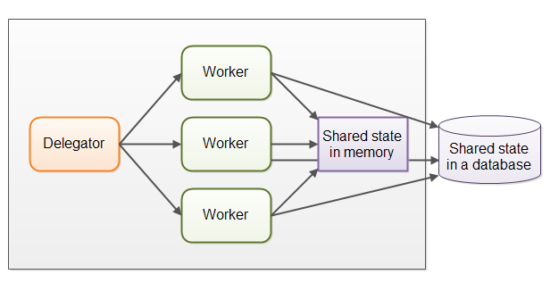
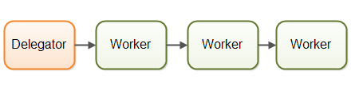
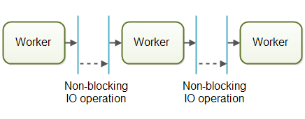
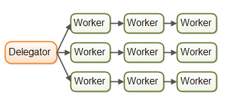
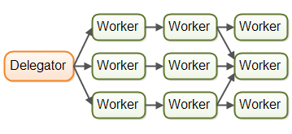

>原文链接：[http://tutorials.jenkov.com/java-concurrency/concurrency-models.html](http://tutorials.jenkov.com/java-concurrency/concurrency-models.html) 

>并发系统可以采用多种并发编程模型来实现。并发模型指定了系统中的线程如何通过协作来完成分配给它们的作业。
不同的并发模型采用不同的方式拆分作业，同时线程间的协作和交互方式也不相同。 

###**并发模型与分布式系统**
并发模型类似于分布式系统中使用的很多体系结构。在并发系统中线程之间可以相互通信。在分布式系统中进程之间也可以相互通信（进程有可能在不同的机器中）。
进程和线程之间具有很多相似性。所以很多并发模型通常类似于各种分布式系统架构。  
分布式系统在处理网络失效、远程主机或进程宕掉等方面也面临着额外的挑战。但运行在巨型服务器上的并发系统也肯能遇到类似的问题，
比如一块CPU失效、一块网卡失效或一个磁盘损坏等情况。  
由于并发模型类似于分布式系统架构，因此它们通常可以互相借鉴思想。例如，为线程分配作业的模型一般与分布式系统的[负载均衡系统](http://tutorials.jenkov.com/software-architecture/load-balancing.html)比较相似。
同样，它们在日志记录、失效转移、幂等性等错误处理技术上也具有相似性。
>幂等性，一个幂等操作的特点是其任意多次执行所产生的影响均与一次执行的影响相同。 

##**一、并行工作者**
第一种并发模型是并行工作者模型。传入的作业会被分配到不同的工作者上。  

 

在并行工作者模型中，委派者（Delegator）将传入的作业分配给不同的工作者。每个工作者完成整个任务。
工作者们并行运作在不同的线程上，甚至可能在不同的CPU上。  

在Java应用系统中，并行工作者模型是最常见的并发模型。[`java.util.concurrent`](http://tutorials.jenkov.com/java-util-concurrent/index.html)包中的许多并发实用工具都是设计用于这个模型的。
Java企业级（J2EE）应用服务器的设计中也有这个模型。  

###**并行工作者模型的优点**
并行工作者模式的优点是，很容易理解。只需要添加更多的工作者来提高系统的并行度。  
例如，做一个网络爬虫，可以试试使用不同数量的工作者抓取到一定数量的页面，然后看看多少数量的工作者消耗的时间最短（即性能最高）。
由于网络爬虫是一个IO密集型工作，最终结果很有可能是电脑中的每个CPU或核心分配了几个线程。每个CPU若只分配一个线程可能有点少，因为在等待数据下载的过程中CPU将会空闲大量时间。
###**并行工作者模型的缺点**
####**共享状态可能会很复杂**
共享的工作者经常需要访问一些共享数据，无论是内存中的或者共享的数据库中的。如下图：  
  

有些共享状态是在像作业队列这样的通信机制下。但也有一些共享状态是业务数据，数据缓存，数据库连接池等。
线程需要以某种方式存取共享数据，以确保某个线程的修改能够对其他线程可见（数据修改需要同步到主存中，不仅仅将数据保存在执行这个线程的CPU的缓存中）。线程需要避免竞态、死锁及很多其他共享状态的并发性问题。  
此外，在等待访问共享数据结构时，线程之间的互相等待将会丢失部分并行性。许多并发数据结构是阻塞的，这意味着在任何一个时间只有一个或者很少的线程能够访问。这样会导致在这些共享数据结构上出现竞争状态。在执行需要访问共享数据结构部分的代码时，高竞争基本上会导致执行时出现一定程度的串行化。  
现在的[非阻塞并发算法](http://tutorials.jenkov.com/java-concurrency/non-blocking-algorithms.html)也许可以降低竞争并提升性能，但是非阻塞算法实现比较困难。  
可持久化的数据结构是另一种选择。在修改的时候，可持久化的数据结构总是保护它的前一个版本不受影响。
因此，如果多个线程指向同一个可持久化的数据结构，并且其中一个线程进行了修改，进行修改的线程会获得一个指向新结构的引用。
所有其他线程保持对旧结构的引用，旧结构没有被修改并且因此保证一致性。Scala编程包含几个持久化数据结构。  
>这里的可持久化数据结构不是指持久化存储，而是一种数据结构，比如Java中的String类，以及CopyOnWriteArrayList类，具体可[参考](http://www.cnblogs.com/tedzhao/archive/2008/11/12/1332112.html)  

虽然可持久化的数据结构在解决共享数据结构的并发修改时显得很优雅，但是在其他方面可持久化数据结构的表现往往不尽人意。
####**工作者无状态**
共享状态能够被系统中得其他线程修改。所以工作者在每次需要的时候必须重读状态，以确保每次都能访问到最新的副本，不管共享状态是保存在内存中的还是在外部数据库中。工作者无法在内部保存这个状态（但是每次需要的时候可以重读）称为无状态的。  

每次都重读需要的数据，将会导致速度变慢，特别是状态保存在外部数据库中的时候。
####**任务顺序不确定**
并行工作者模式的另一个缺点是，作业执行顺序是不确定的。无法保证哪个作业最先或者最后被执行。作业A可能在作业B之前就被分配工作者了，但是作业B反而有可能在作业A之前执行。

并行工作者模式的这种非确定性的特性，使得很难在任何特定的时间点推断系统的状态。这也使得它也更难（如果不是不可能的话）保证一个作业在其他作业之前被执行。  

##**二、流水线并发模型**
下图表示一个流水线并发模型：  

  

每个工作者只负责作业中的部分工作。当完成了自己的这部分工作时工作者会将作业转发给下一个工作者。每个工作者在自己的线程中运行，并且不会和其他工作者共享状态。有时也被成为无共享并行模型。  
通常使用**非阻塞的IO**来设计使用流水线并发模型的系统。非阻塞IO意味着，一旦某个工作者开始一个IO操作的时候（比如读取文件或从网络连接中读取数据），这个工作者不会一直等待IO操作的结束。IO操作速度很慢，所以等待IO操作结束很浪费CPU时间。此时CPU可以做一些其他事情。当IO操作完成的时候，IO操作的结果（比如读出的数据或者数据写完的状态）被传递给下一个工作者。                                  有了非阻塞IO，就可以使用IO操作确定工作者之间的边界。工作者会尽可能多运行直到遇到并启动一个IO操作。然后交出作业的控制权。当IO操作完成的时候，在流水线上的下一个工作者继续进行操作，直到它也遇到并启动一个IO操作。   

  

实际应用中，作业有可能不会沿着单一流水线进行。由于大多数系统可以执行多个作业，作业从一个工作者流向另一个工作者取决于作业需要做的工作。在实际中可能会有多个不同的虚拟流水线同时运行。这是现实当中作业在流水线系统中可能的移动情况：   

  

作业甚至也有可能被转发到超过一个工作者上并发处理。比如说，作业有可能被同时转发到作业执行器和作业日志器。下图说明了三条流水线是如何通过将作业转发给同一个工作者（中间流水线的最后一个工作者）来完成作业:  

  

###**反应器，事件驱动系统**
采用流水线并发模型的系统有时候也称为反应器系统或事件驱动系统。系统内的工作者对系统内出现的事件做出反应，这些事件也有可能来自于外部世界或者发自其他工作者。事件可以是传入的HTTP请求，也可以是某个文件成功加载到内存中等。  
比较流行的反应器/事件驱动平台：
+[Vert.x](http://tutorials.jenkov.com/vert.x/index.html)  

+AKKa  

+Node.JS(JavaScript)  

###**Actors和Channels** 
Actors 和 channels 是两种比较类似的流水线（或反应器/事件驱动）模型。

在Actor模型中每个工作者被称为actor。Actor之间可以直接异步地发送和处理消息。Actor可以被用来实现一个或多个像前文描述的那样的作业处理流水线。下图给出了Actor模型：  
  

而在Channel模型中，工作者之间不直接进行通信。相反，它们在不同的通道中发布自己的消息（事件）。其他工作者们可以在这些通道上监听消息，发送者无需知道谁在监听。下图给出了Channel模型：  
  

channel模型似乎更加灵活。一个工作者无需知道谁在后面的流水线上处理作业。只需知道作业（或消息等）需要转发给哪个通道。通道上的监听者可以随意订阅或者取消订阅，并不会影响向这个通道发送消息的工作者。这使得工作者之间具有松散的耦合。  

###**流水线模型的优点**  
####**无需共享状态** 
工作者之间无需共享状态，意味着实现的时候无需考虑所有因并发访问共享对象而产生的并发性问题。在实现工作者的时候就好像是单个线程在处理工作---基本上是一个单线程的实现。
####**有状态的工作者**  
当工作者知道了没有其他线程可以修改它们的数据，工作者可以变成有状态的。对于有状态，我是指，它们可以在内存中保存它们需要操作的数据，只需在最后将更改写回到外部存储系统。因此，有状态的工作者通常比无状态的工作者具有更高的性能。    
####**较好的硬件整合**  
单线程代码在整合底层硬件的时候往往具有更好的优势。首先，当能确定代码只在单线程模式下执行的时候，通常能够创建更优化的数据结构和算法。  
其次，单线程有状态的工作者能够在内存中缓存数据。在内存中缓存数据的同时，也意味着数据很有可能也缓存在执行这个线程的CPU的缓存中。这使得访问缓存的数据变得更快。  
硬件整合是指，以某种方式编写的代码，使得能够自然地受益于底层硬件的工作原理。有些开发者称之为mechanical sympathy。  
####**合理的作业顺序**  
基于流水线并发模型实现的并发系统，在某种程度上是有可能保证作业的顺序的。作业的有序性使得它更容易地推出系统在某个特定时间点的状态。更进一步，你可以将所有到达的作业写入到日志中去。一旦这个系统的某一部分挂掉了，该日志就可以用来重头开始重建系统当时的状态。按照特定的顺序将作业写入日志，并按这个顺序作为有保障的作业顺序。下图展示了一种可能的设计：  
  

实现一个有保障的作业顺序不容易，但往往是可行的。如果可以，它将大大简化一些任务，例如备份、数据恢复、数据复制等，这些都可以通过日志文件来完成。  
###**流水线模型的缺点**  
流水线并发模型最大的缺点是作业的执行往往分布到多个工作者上，并因此分布到项目中的多个类上。这样导致在追踪某个作业到底被什么代码执行时变得困难。  
这也加大了代码编写的难度。有时会将工作者的代码写成回调处理的形式。若在代码中嵌入过多的回调处理，往往会出现所谓的回调地狱（callback hell）现象。所谓回调地狱，就是在追踪代码在回调过程中到底做了什么，以及确保每个回调只访问它需要的数据的时候，变得非常麻烦。  
使用并行工作者模型可以简化这个问题。你可以打开工作者的代码，从头到尾优美的阅读被执行的代码。当然并行工作者模式的代码也可能同样分布在不同的类中，但往往也能够很容易的从代码中分析执行的顺序。  

##**函数式并行（Functional Parallelism）**  
函数式并行的基本思想是采用函数调用实现程序。函数可以看作是”代理人（agents）“或者”actor“，函数之间可以像流水线模型（AKA 反应器或者事件驱动系统）那样互相发送消息。某个函数调用另一个函数，这个过程类似于消息发送。  
函数都是通过拷贝来传递参数的，所以除了接收函数外没有实体可以操作数据。这对于避免共享数据的竞态来说是很有必要的。同样也使得函数的执行类似于原子操作。每个函数调用的执行独立于任何其他函数的调用。  
一旦每个函数调用都可以独立的执行，它们就可以分散在不同的CPU上执行了。这也就意味着能够在多处理器上并行的执行使用函数式实现的算法。  
Java7中的java.util.concurrent包里包含的ForkAndJoinPool能够帮助我们实现类似于函数式并行的一些东西。而Java8中并行streams能够用来帮助我们并行的迭代大型集合。  
函数式并行里面最难的是确定需要并行的那个函数调用。跨CPU协调函数调用需要一定的开销。某个函数完成的工作单元需要达到某个大小以弥补这个开销。如果函数调用作用非常小，将它并行化可能比单线程、单CPU执行还慢。  
此外，将任务拆分给多个CPU时协调造成的开销，仅仅在该任务是程序当前执行的唯一任务时才有意义。但是，如果当前系统正在执行多个其他的任务时（比如web服务器，数据库服务器或者很多其他类似的系统），将单个任务进行并行化是没有意义的。不管怎样计算机中的其他CPU们都在忙于处理其他任务，没有理由用一个慢的、函数式并行的任务去扰乱它们。使用流水线（反应器）并发模型可能会更好一点，因为它开销更小（在单线程模式下顺序执行）同时能更好的与底层硬件整合。  
##**使用哪种并发模型最好**
通常，这个答案取决于你的系统打算做什么。如果你的作业本身就是并行的、独立的并且没有必要共享状态，你可能会使用并行工作者模型去实现你的系统。虽然许多作业都不是自然并行和独立的。对于这种类型的系统，使用流水线并发模型能够更好的发挥它的优势，而且比并行工作者模型更有优势。
